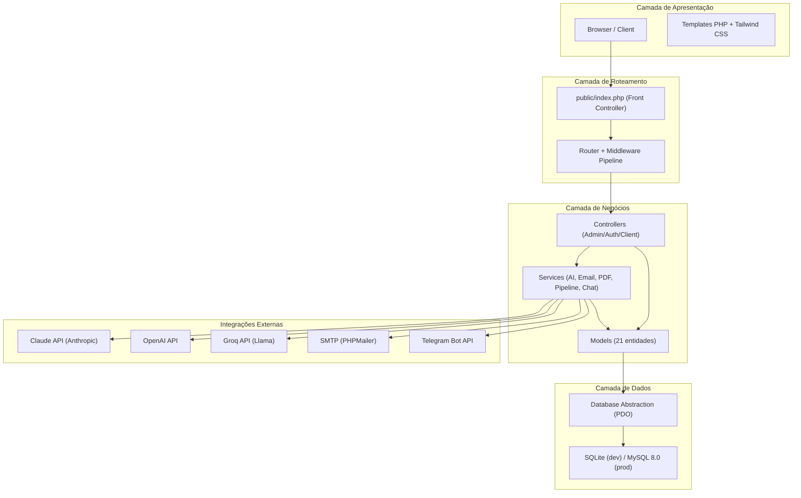
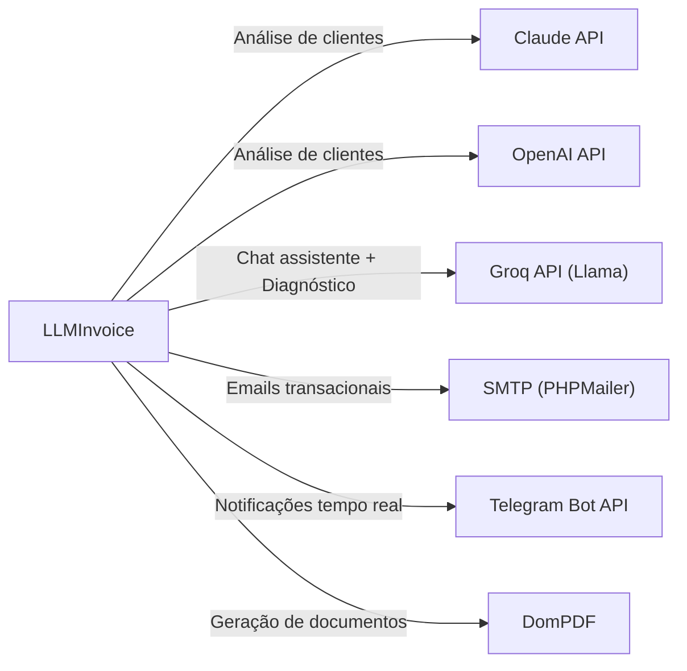
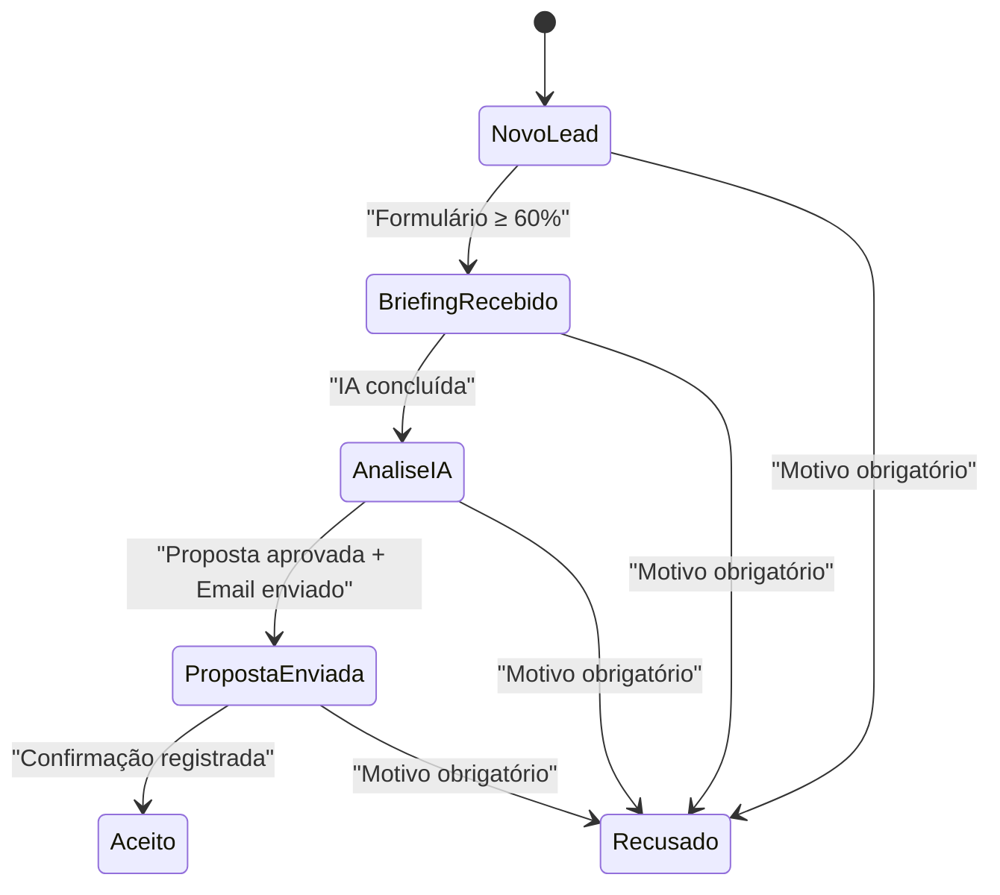
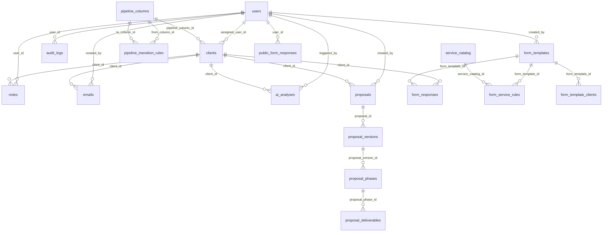
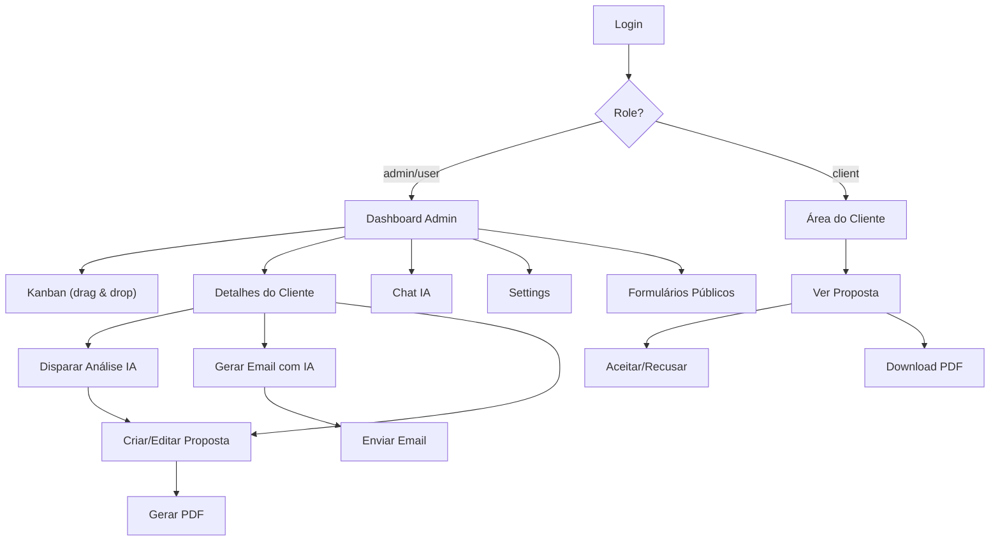
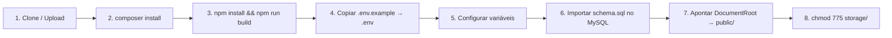

# LLMInvoice — Documento Técnico Completo

> **Versão:** 1.0 — 11/02/2026  
> **Stack:** PHP 8.4 · MySQL/SQLite · Tailwind CSS · Multi-AI (Claude/OpenAI/Groq)

---

## 1. Visão Geral do Projeto

### 1.1 Propósito

O **LLMInvoice** é uma plataforma de gestão comercial inteligente que automatiza o pipeline de vendas — do lead ao contrato assinado — usando inteligência artificial como motor de decisão. O sistema captura leads, analisa suas necessidades com IA, gera propostas comerciais automatizadas e gerencia todo o ciclo de vida do cliente através de um quadro Kanban com regras de transição.

### 1.2 Público-Alvo

| Perfil | Descrição |
|--------|-----------|
| **Agências digitais** | Consultorias e agências que precisam qualificar leads e gerar propostas rapidamente |
| **Freelancers seniores** | Profissionais que vendem serviços de tecnologia e precisam de automação comercial |
| **Software houses** | Empresas de desenvolvimento que recebem briefings e precisam de análise e orçamentação |

### 1.3 Problema que Resolve

O processo comercial em empresas de tecnologia é frequentemente **manual, lento e inconsistente**:

- Leads chegam, mas o briefing é incompleto → a IA completa a análise
- Propostas levam dias para serem criadas → a IA gera em segundos
- Follow-ups são esquecidos → o pipeline Kanban com regras garante avanço controlado
- Não há visibilidade do status de cada negociação → dashboard com métricas em tempo real

---

## 2. Arquitetura do Sistema

### 2.1 Diagrama de Arquitetura



### 2.2 Camadas do Sistema

| Camada | Responsabilidade | Componentes |
|--------|-----------------|-------------|
| **Apresentação** | Renderização de HTML, interação com o usuário | Templates PHP, Tailwind CSS, JavaScript vanilla |
| **Roteamento** | Receber requisições HTTP e despachar para controllers | `Router`, `Middleware`, `Request`, `Response` |
| **Negócios** | Lógica de aplicação, regras, orquestração | 20 Controllers, 13 Services, `Validator` |
| **Dados** | Persistência e consultas ao banco | 21 Models, `Database` (PDO singleton) |
| **Infraestrutura** | Logging, sessões, CSRF, i18n | `Logger`, `Session`, `Csrf`, `App` |

### 2.3 Padrão Arquitetural: MVC Customizado

O projeto implementa um **MVC (Model-View-Controller)** puro sem framework, com:

- **Front Controller** (`public/index.php`) — ponto único de entrada
- **Router** com suporte a parâmetros dinâmicos (`{id}`, `{token}`, `{uuid}`)
- **Middleware pipeline** declarativo por rota (`['auth', 'role:admin', 'csrf']`)
- **Services layer** separando lógica complexa dos controllers
- **Static Models** como data-access layer com métodos estáticos

### 2.4 Tecnologias

| Componente | Tecnologia | Versão |
|-----------|-----------|--------|
| Linguagem | PHP | 8.4+ |
| Banco (dev) | SQLite | 3.x |
| Banco (prod) | MySQL | 8.0+ |
| CSS Framework | Tailwind CSS | 3.x |
| PDF Engine | DomPDF | 3.0 |
| Email | PHPMailer | 6.8 |
| Env Loader | vlucas/phpdotenv | 5.5 |
| Autoloader | Composer PSR-4 | — |
| IA (primário) | Groq (Llama 3.3 70B) | API v1 |
| IA (secundário) | Claude (Anthropic) | claude-sonnet-4-20250514 |
| IA (terciário) | OpenAI | GPT-4o |

---

## 3. Estrutura de Back-end

### 3.1 Estrutura de Pastas

```
llminvoice/
├── config/                      # Configurações centralizadas
│   ├── ai.php                   #   Providers de IA (Claude/OpenAI/Groq)
│   ├── app.php                  #   Nome, URL, timezone, locale
│   ├── database.php             #   Conexão MySQL/SQLite
│   ├── email.php                #   SMTP settings
│   ├── permissions.php          #   RBAC: admin, user, client
│   └── routes.php               #   154 rotas declarativas
│
├── database/
│   ├── schema.sql               #   Schema completo MySQL (20 tabelas + seed)
│   ├── migrations/              #   8 migrações incrementais
│   │   ├── 001_*.sql … 008_public_form_responses.sql
│   └── database.sqlite          #   Banco SQLite para desenvolvimento
│
├── src/
│   ├── Core/                    # Framework core (11 classes)
│   │   ├── App.php              #   Bootstrap, sessão, timezone
│   │   ├── Csrf.php             #   Geração e validação de tokens
│   │   ├── Database.php         #   PDO singleton, CRUD helpers
│   │   ├── Logger.php           #   Audit log (DB) + file logging
│   │   ├── Middleware.php       #   Pipeline de middleware
│   │   ├── Pagination.php       #   Paginação genérica
│   │   ├── Request.php          #   Abstração de request HTTP
│   │   ├── Response.php         #   View rendering, JSON, redirect
│   │   ├── Router.php           #   Matching de rotas
│   │   ├── Session.php          #   Gestão de sessões
│   │   └── Validator.php        #   Validação fluent
│   │
│   ├── Controllers/
│   │   ├── Admin/               # 12 controllers de administração
│   │   │   ├── AiController.php
│   │   │   ├── ChatController.php
│   │   │   ├── ClientController.php
│   │   │   ├── DashboardController.php
│   │   │   ├── EmailController.php
│   │   │   ├── FormBuilderController.php
│   │   │   ├── KanbanController.php
│   │   │   ├── ProposalController.php
│   │   │   ├── PublicFormAdminController.php
│   │   │   ├── ReportController.php
│   │   │   ├── SettingsController.php
│   │   │   └── UserController.php
│   │   ├── Auth/                # 3 controllers de autenticação
│   │   │   ├── LoginController.php
│   │   │   ├── LogoutController.php
│   │   │   └── PasswordController.php
│   │   └── Client/              # 5 controllers públicos/cliente
│   │       ├── AcceptController.php
│   │       ├── FormController.php
│   │       ├── LeadCaptureController.php
│   │       ├── ProposalViewController.php
│   │       └── PublicFormController.php
│   │
│   ├── Helpers/                 # 5 arquivos de funções globais
│   │   ├── functions.php        #   auth_check, auth_id, flash, config, env, url, etc.
│   │   ├── html.php             #   is_active, pagination_links, status_badge, etc.
│   │   ├── date.php             #   Formatação de datas
│   │   ├── money.php            #   Formatação monetária (BRL)
│   │   └── text.php             #   sanitize, slugify, truncate, highlight
│   │
│   ├── Middleware/              # 5 middleware
│   │   ├── AuditMiddleware.php
│   │   ├── AuthMiddleware.php
│   │   ├── CsrfMiddleware.php
│   │   ├── LocaleMiddleware.php
│   │   └── RoleMiddleware.php
│   │
│   ├── Models/                  # 21 modelos de dados
│   │   ├── AiAnalysis.php       #   Análises IA com custo e tokens
│   │   ├── AuditLog.php         #   Logs de auditoria
│   │   ├── Branding.php         #   White-label (logo, cores, textos)
│   │   ├── ChatMessage.php      #   Mensagens do chat IA
│   │   ├── ChatThread.php       #   Threads de conversa
│   │   ├── Client.php           #   Clientes/Leads (entidade central)
│   │   ├── EmailModel.php       #   Emails com tracking
│   │   ├── FormResponse.php     #   Respostas de formulários
│   │   ├── FormServiceRule.php  #   Regras de matching form→serviço
│   │   ├── FormTemplate.php     #   Templates de formulário (JSON)
│   │   ├── FormTemplateClient.php # Associação form↔cliente
│   │   ├── Note.php             #   Notas e follow-ups
│   │   ├── PipelineColumn.php   #   Colunas do Kanban
│   │   ├── Proposal.php         #   Propostas comerciais
│   │   ├── ProposalDeliverable.php # Entregáveis das propostas
│   │   ├── ProposalPhase.php    #   Fases das propostas
│   │   ├── ProposalVersion.php  #   Versionamento de propostas
│   │   ├── PublicFormResponse.php # Formulários públicos (diagnóstico)
│   │   ├── ServiceCatalog.php   #   Catálogo de serviços
│   │   ├── Setting.php          #   Settings key-value
│   │   └── User.php             #   Usuários e roles
│   │
│   └── Services/                # 13 serviços de domínio
│       ├── AiPromptBuilder.php  #   Construção de prompts para IA
│       ├── AiResultParser.php   #   Parsing de respostas da IA
│       ├── AiService.php        #   Orquestração de análise IA
│       ├── ChatAttachmentService.php # Upload de anexos no chat
│       ├── EmailService.php     #   Envio de emails (SMTP)
│       ├── ExportService.php    #   Exportação CSV/Markdown
│       ├── FormServiceMatcher.php #  Matching automático form→serviços
│       ├── GroqChatService.php  #   Chat conversacional (Llama/Groq)
│       ├── PdfService.php       #   Geração de PDFs (DomPDF)
│       ├── PipelineService.php  #   Regras de transição do Kanban
│       ├── ProposalService.php  #   Criação de propostas a partir da IA
│       ├── SearchService.php    #   Busca full-text
│       └── TelegramService.php  #   Notificações Telegram
│
├── templates/
│   ├── layouts/                 # 5 layouts (admin, client, auth, email, landing)
│   ├── pages/                   # 32 templates de página
│   ├── partials/                # 13 componentes reutilizáveis
│   ├── emails/                  # Templates de email
│   └── pdf/                     # Templates de PDF (proposta, simulação)
│
├── public/
│   └── index.php                # Front Controller (ponto de entrada)
│
├── lang/                        # Internacionalização (pt, en, es)
├── storage/                     # Logs e uploads
└── .env                         # Variáveis de ambiente
```

### 3.2 Endpoints da API

#### Autenticação (4 rotas)

| Método | Rota | Descrição |
|--------|------|-----------|
| `GET` | `/login` | Formulário de login |
| `POST` | `/login` | Autenticar usuário |
| `GET` | `/logout` | Encerrar sessão |
| `GET/POST` | `/forgot-password` | Reset de senha |

#### Admin — Páginas (15 rotas)

| Método | Rota | Descrição |
|--------|------|-----------|
| `GET` | `/admin` | Dashboard principal |
| `GET` | `/admin/kanban` | Quadro Kanban |
| `GET/POST` | `/admin/clients/create` | Criar cliente |
| `GET` | `/admin/clients/{id}` | Detalhes do cliente |
| `GET` | `/admin/users` | Gestão de usuários |
| `GET/POST` | `/admin/settings` | Configurações gerais |
| `GET/POST` | `/admin/settings/services` | Catálogo de serviços |
| `GET/POST` | `/admin/settings/branding` | White-label |
| `GET` | `/admin/settings/forms` | Form builder |
| `GET` | `/admin/reports` | Relatórios |
| `GET` | `/admin/audit-log` | Logs de auditoria |
| `GET` | `/admin/chat` | Chat IA |
| `GET` | `/admin/public-forms` | Formulários públicos |

#### API AJAX — Kanban (5 rotas)

| Método | Rota | Descrição |
|--------|------|-----------|
| `GET` | `/api/kanban/columns` | Colunas com cards |
| `POST` | `/api/kanban/move` | Mover card entre colunas |
| `POST` | `/api/kanban/reorder` | Reordenar na mesma coluna |
| `GET` | `/api/kanban/search` | Buscar no Kanban |
| `GET` | `/api/kanban/filter` | Filtrar por critérios |

#### API AJAX — Clientes (5 rotas)

| Método | Rota | Descrição |
|--------|------|-----------|
| `POST` | `/api/clients/{id}/assign` | Atribuir responsável |
| `POST` | `/api/clients/{id}/note` | Adicionar nota |
| `POST` | `/api/clients/{id}/archive` | Arquivar lead |
| `POST` | `/api/clients/{id}/accept` | Marcar como aceito |
| `POST` | `/api/clients/{id}/temperature` | Alterar temperatura |

#### API AJAX — IA e Chat (11 rotas)

| Método | Rota | Descrição |
|--------|------|-----------|
| `POST` | `/api/ai/analyze/{clientId}` | Disparar análise IA |
| `GET` | `/api/ai/status/{analysisId}` | Status da análise |
| `GET` | `/api/ai/result/{analysisId}` | Resultado da análise |
| `GET` | `/api/chat/threads` | Listar threads |
| `POST` | `/api/chat/threads` | Criar thread |
| `GET` | `/api/chat/threads/{id}` | Mensagens de uma thread |
| `POST` | `/api/chat/send` | Enviar mensagem ao chat |
| `POST` | `/api/chat/threads/{id}/rename` | Renomear thread |
| `POST` | `/api/chat/threads/{id}/clear` | Limpar thread |
| `GET` | `/api/chat/meta` | Metadados do assistente |
| `POST` | `/api/chat/meta/update` | Atualizar metadados |

#### API AJAX — Propostas (4 rotas)

| Método | Rota | Descrição |
|--------|------|-----------|
| `POST` | `/api/proposals/{clientId}` | Salvar proposta |
| `POST` | `/api/proposals/{id}/approve` | Aprovar proposta |
| `GET` | `/api/proposals/{id}/versions` | Versões da proposta |
| `GET` | `/api/proposals/{clientId}/pdf` | Download PDF |

#### API AJAX — Emails (3 rotas)

| Método | Rota | Descrição |
|--------|------|-----------|
| `POST` | `/api/emails/{clientId}/generate` | Gerar email com IA |
| `POST` | `/api/emails/{id}/send` | Enviar email |
| `GET` | `/api/emails/{clientId}/history` | Histórico de emails |

#### Formulário Público de Diagnóstico (6 rotas — sem autenticação)

| Método | Rota | Descrição |
|--------|------|-----------|
| `GET` | `/diagnostico` | Wizard do formulário |
| `POST` | `/diagnostico` | Submeter formulário |
| `GET` | `/diagnostico/obrigado` | Página de agradecimento |
| `POST` | `/diagnostico/cadastro` | Registrar usuário |
| `GET` | `/diagnostico/termos` | Termos de uso |
| `POST` | `/api/diagnostico/analyze` | Preview de análise IA |

#### Admin — Formulários Públicos (6 rotas)

| Método | Rota | Descrição |
|--------|------|-----------|
| `GET` | `/admin/public-forms` | Dashboard de formulários |
| `GET` | `/api/public-forms/{id}` | Detalhes em JSON |
| `POST` | `/api/public-forms/{id}/approve` | Aprovar |
| `POST` | `/api/public-forms/{id}/reject` | Rejeitar |
| `GET` | `/admin/public-forms/export-md` | Exportar Markdown |
| `POST` | `/admin/settings/services/import` | Importar serviços JSON |

#### Área do Cliente (7 rotas — acesso via token/UUID)

| Método | Rota | Descrição |
|--------|------|-----------|
| `GET` | `/form/{token}` | Formulário de briefing |
| `POST` | `/form/{token}` | Submeter briefing |
| `GET` | `/form/{token}/thank-you` | Agradecimento |
| `POST` | `/form/{token}/autosave` | Salvar rascunho |
| `GET` | `/proposal/{uuid}` | Ver proposta |
| `POST` | `/proposal/{uuid}/accept` | Aceitar proposta |
| `GET` | `/proposal/{uuid}/pdf` | Download PDF da proposta |

### 3.3 Sistema de Autenticação e Autorização

#### Autenticação

Baseada em **sessões PHP** com cookies seguros:

```php
// App.php — Bootstrap da sessão
session_start([
    'cookie_httponly' => true,
    'cookie_samesite' => 'Lax',
]);

// Geração de CSRF token por sessão
if (empty($_SESSION['_csrf'])) {
    $_SESSION['_csrf'] = bin2hex(random_bytes(32));
}

// Timeout por inatividade
if (isset($_SESSION['last_activity'])) {
    $timeout = (int) env('SESSION_IDLE_TIMEOUT', 1800);
    if (time() - $_SESSION['last_activity'] > $timeout) {
        session_destroy(); // Expirar sessão
    }
}
```

#### Autorização — RBAC (Role-Based Access Control)

Três perfis com permissões granulares definidas em [permissions.php](file:///c:/Users/Yohann/Downloads/Organizados/llminvoice/config/permissions.php):

| Role | Permissões |
|------|-----------|
| **admin** | Acesso total: kanban, clientes, IA, propostas, emails, usuários, settings, relatórios, auditoria, form builder |
| **user** | Operacional: kanban, clientes atribuídos, IA, propostas (sem aprovar), emails |
| **client** | Limitado: preencher formulário, ver proposta própria, aceitar proposta |

#### Middleware Pipeline

Cada rota declara seus middlewares de forma explícita:

```php
// routes.php
'POST /api/kanban/move' => ['Admin\KanbanController', 'moveCard', ['auth', 'role:admin|user', 'csrf']],
```

O middleware é executado em sequência: **auth → role → csrf**.

### 3.4 Validação — API Fluent

O [Validator](file:///c:/Users/Yohann/Downloads/Organizados/llminvoice/src/Core/Validator.php) implementa uma API fluent com suporte a i18n:

```php
$validator = Validator::make($request->all())
    ->required('name')
    ->email('email')
    ->minLength('password', 8)
    ->confirmed('password')
    ->in('role', ['admin', 'user', 'client']);

if ($validator->fails()) {
    return Response::json(['errors' => $validator->errors()], 422);
}

$data = $validator->validated(); // Dados limpos sem _csrf
```

**Regras disponíveis:** `required`, `email`, `minLength`, `maxLength`, `in`, `numeric`, `integer`, `confirmed`.

### 3.5 Tratamento de Erros e Logging

O sistema possui **dois níveis de logging**:

| Tipo | Destino | Método | Uso |
|------|---------|--------|-----|
| **Audit Log** | Tabela `audit_logs` no banco | `Logger::audit()` | Ações de usuário (criar, editar, aprovar, rejeitar) |
| **Error Log** | `storage/logs/error.log` | `Logger::error()` | Exceções e falhas de sistema |
| **Info Log** | `storage/logs/app.log` | `Logger::info()` | Eventos informativos (email enviado, IA processada) |

```php
// Exemplo: audit log com valores antigos e novos
Logger::audit('update', 'client', $clientId, $oldData, $newData);
```

> [!IMPORTANT]
> O audit log é **fail-safe**: se falhar, registra no arquivo de erro sem interromper a aplicação.

### 3.6 Integrações Externas



| Integração | Protocolo | Autenticação | Fallback |
|-----------|-----------|-------------|----------|
| Claude | HTTPS REST | `x-api-key` header | Erro gracioso com log |
| OpenAI | HTTPS REST | `Bearer` token | Erro gracioso com log |
| Groq | HTTPS REST (compatível OpenAI) | `Bearer` token | Modelo mais barato se falhar |
| SMTP | SMTP/TLS | Username + Password | Log de falha, sem retry |
| Telegram | HTTPS REST | Bot Token na URL | Silencioso se não configurado |

---

## 4. Funcionalidades Principais

### 4.1 Pipeline Kanban Inteligente

**Fluxo**: Novo Lead → Briefing Recebido → Análise IA → Proposta Enviada → Aceito/Recusado



- **Drag & Drop** com validação de regras de transição
- **Reordenação** dentro da mesma coluna
- **Filtros**: temperatura, responsável, busca textual
- **Regras configuráveis** por transição (min_responses, ai_completed, proposal_approved, email_sent, acceptance_confirmed, archive_reason)

### 4.2 Análise de Clientes com IA

1. Admin dispara análise para um cliente (`/api/ai/analyze/{clientId}`)
2. `AiService` coleta: dados do cliente + respostas do formulário + catálogo de serviços
3. `AiPromptBuilder` monta prompt estruturado com context de branding
4. IA retorna: diagnóstico, recomendações, riscos, estrutura de proposta, faixa de preço, plano de execução
5. `AiResultParser` extrai JSON estruturado da resposta
6. Resultados salvos na tabela `ai_analyses` com tracking de custo

**Métricas rastreadas por análise:**
- Tokens de entrada e saída
- Custo em USD
- Tempo de processamento (ms)
- Provider e modelo utilizados

### 4.3 Chat Conversacional com IA (Groq/Llama)

O [GroqChatService](file:///c:/Users/Yohann/Downloads/Organizados/llminvoice/src/Services/GroqChatService.php) implementa um assistente inteligente com:

- **Roteamento de modelos** automático: mensagens curtas → modelo barato (`llama-3.1-8b-instant`), complexas → modelo avançado (`llama-3.3-70b-versatile`), com imagem → modelo de visão
- **System prompt** enriquecido com contexto de branding e catálogo de serviços
- **Restrições de segurança** (não divulgar prompts, não gerar código malicioso)
- **Histórico** com janela de 30 mensagens
- **Threads** com renomear, limpar e múltiplas conversas

### 4.4 Propostas Comerciais Automatizadas

1. IA analisa o cliente e gera `proposal_structure` + `pricing_range`
2. `ProposalService::createFromAi()` cria proposta com fases e entregáveis
3. **Versionamento**: cada edição cria uma nova versão, mantendo histórico
4. **Fases** com duração, valor individual e flag de opcional
5. **PDF** gerado via DomPDF com branding customizado
6. **Link público** via UUID para o cliente visualizar e aceitar

### 4.5 Form Builder Dinâmico

- Templates de formulário com **estrutura JSON** (seções, campos, tipos)
- Suporte a tipos: `text`, `textarea`, `select`, `url`, `checkbox`, `radio`
- Campos com **pesos para IA** (`ai_weight`: high/medium/low) e dicas (`ai_hint`)
- **Vinculação** form ↔ cliente com token exclusivo
- **Autosave** automático durante preenchimento
- **Regras de matching** form → serviço com operadores lógicos (AND/OR)

### 4.6 Formulário Público de Diagnóstico (sem login)

Wizard de **6 passos** em `/diagnostico`:

| Passo | Conteúdo |
|-------|---------|
| 1 | Objetivo do projeto (textarea) |
| 2 | Processo atual de trabalho (textarea) |
| 3 | Volume/escala do projeto (select) |
| 4 | Dados de contato (nome, email, telefone, empresa) |
| 5 | Regulador de ansiedade (slider 1-10 com animação) |
| 6 | Preview IA + aceitação de termos |

**Fluxo pós-submissão:**
1. IA (Groq) analisa respostas e sugere serviços
2. Notificação Telegram para admin
3. Página de agradecimento com resumo IA
4. Opção de cadastro com geração automática de credenciais
5. Credenciais enviadas por email

### 4.7 Gestão de Emails

- **Geração** de emails com IA (tom: formal, amigável, persuasivo, consultivo)
- **Envio** via SMTP configurável
- **Tracking**: pixel de abertura + tracking de cliques
- **Status**: draft → scheduled → sent → opened → clicked → replied
- **Notificação** automática ao admin quando novo lead chega

### 4.8 Exportação e Importação

| Formato | Direção | Escopo |
|---------|---------|--------|
| **CSV** | Exportação | Clientes, relatórios |
| **Markdown** | Exportação | Formulários públicos (individual e batch) |
| **PDF** | Exportação | Propostas e simulações |
| **JSON** | Importação | Catálogo de serviços |

### 4.9 White-Label (Branding)

Configuração completa de identidade visual:

- Logo (claro e escuro)
- Cor primária
- Tagline
- Footer de email (HTML)
- Header/footer de proposta (HTML)
- Contexto de identidade para a IA
- Landing page customizável (hero, features, testimonials)

### 4.10 Internacionalização (i18n)

Suporte a **3 idiomas**: Português, English, Español

- Strings traduzidas via função `__('key')`
- Colunas de pipeline traduzidas (`name_pt`, `name_en`, `name_es`)
- Mensagens de erro de transição traduzidas por idioma
- Cookie + sessão para persistência do idioma escolhido

---

## 5. Banco de Dados

### 5.1 Diagrama ER (Entidade-Relacionamento)



### 5.2 Tabelas Principais

| # | Tabela | Registros-chave | Papel no sistema |
|---|--------|----------------|-----------------|
| 1 | `users` | id, email, role, password_hash | Autenticação e autorização |
| 2 | `pipeline_columns` | slug, name_pt/en/es, sort_order | Estágios do Kanban |
| 3 | `clients` | uuid, contact_name/email, temperature, pipeline_column_id | Entidade central (lead/cliente) |
| 4 | `pipeline_transition_rules` | from_column_id, to_column_id, rule_type | Regras de transição do Kanban |
| 5 | `form_templates` | structure (JSON), is_active | Templates de formulário dinâmico |
| 6 | `form_responses` | responses (JSON), completion_pct | Respostas dos formulários |
| 7 | `ai_analyses` | diagnosis, recommendations, risks (JSON), cost_usd | Análises de IA com tracking de custo |
| 8 | `proposals` | client_id, current_version_id, status | Propostas comerciais |
| 9 | `proposal_versions` | premises, risks (JSON), total_value, valid_until | Versões com rollback |
| 10 | `proposal_phases` | title, duration_days, value, is_optional | Fases da proposta |
| 11 | `proposal_deliverables` | title, description, sort_order | Entregáveis por fase |
| 12 | `emails` | subject, body_html, tracking_id, status | Emails com pixel tracking |
| 13 | `notes` | type (note/follow_up/call/meeting), content | Notas e follow-ups |
| 14 | `service_catalog` | name, category, base_price_min/max, technical_difficulty | Catálogo de serviços |
| 15 | `audit_logs` | action, entity_type, old_values, new_values (JSON) | Histórico completo de alterações |
| 16 | `sessions` | payload, last_activity | Sessões do PHP |
| 17 | `settings` | setting_key, setting_value, setting_group | Configurações dinâmicas |
| 18 | `branding` | company_name, logo, primary_color, landing_* | White-label |
| 19 | `form_service_rules` | conditions (JSON), logic_operator | Matching form → serviço |
| 20 | `form_template_clients` | form_template_id, client_id | Vinculação form ↔ cliente |
| 21 | `public_form_responses` | uuid, responses, ai_analysis, suggested_services (JSON) | Diagnósticos públicos |

### 5.3 Índices e Otimizações

- **Full-text** search em `clients` (company_name, contact_name, contact_email)
- **Composite index** em `clients` (pipeline_column_id + position_in_column) para ordenação do Kanban
- **Unique constraints** em: users.email, clients.uuid, clients.form_token, settings.setting_key
- **Foreign keys** com `ON DELETE CASCADE` para consistência referencial
- **JSON columns** para dados flexíveis (responses, diagnosis, conditions, premises)

### 5.4 Estratégia de Banco Dual

| Ambiente | Banco | Motivação |
|---------|-------|-----------|
| **Desenvolvimento** | SQLite | Zero configuração, arquivo único |
| **Produção** | MySQL 8.0+ | Performance, full-text search, concorrência |

O [Database.php](file:///c:/Users/Yohann/Downloads/Organizados/llminvoice/src/Core/Database.php) detecta automaticamente o driver via `DB_CONNECTION`:

```php
if (($config['connection'] ?? 'mysql') === 'sqlite') {
    $dsn = 'sqlite:' . $dbPath;
} else {
    $dsn = sprintf('mysql:host=%s;port=%s;dbname=%s;charset=%s', ...);
}
```

---

## 6. Pontos Positivos e Diferenciais

### 6.1 Vantagens Técnicas

| Aspecto | Implementação |
|---------|--------------|
| **Zero framework** | Sem overhead de framework pesado; 100% do código é do domínio |
| **Multi-AI** | 3 providers (Claude, OpenAI, Groq) com fallback e roteamento inteligente |
| **Banco dual** | SQLite para dev, MySQL para prod — sem alterar código |
| **Pipeline com regras** | Transições validadas automaticamente, impossível pular etapas |
| **Versionamento de propostas** | Histórico completo, rollback implícito |
| **Form builder JSON** | Formulários dinâmicos sem alterar código |
| **White-label** | Branding completo configurável pelo admin |
| **i18n nativo** | 3 idiomas sem dependência externa |
| **Audit trail completo** | Toda ação registrada com valores antigos/novos |

### 6.2 Segurança

| Controle | Implementação |
|----------|--------------|
| **CSRF** | Token por sessão, validado em todo POST |
| **XSS** | `htmlspecialchars()` / `e()` em todo output |
| **SQL Injection** | Prepared statements (PDO) em 100% das queries |
| **Auth** | bcrypt (`PASSWORD_BCRYPT`) para senhas |
| **Session** | HttpOnly, SameSite=Lax, idle timeout configurável |
| **Role-based** | Middleware por rota com roles granulares |
| **Input sanitization** | `sanitize()` helper em entradas de texto |
| **Rate limiting** | Regras de transição impedem ações inválidas |

### 6.3 Escalabilidade

- **Stateless controllers** — sem estado em memória entre requisições
- **Database singleton** — uma conexão PDO por request
- **Paginação** em todas as listagens (configurável via settings)
- **JSON columns** evitam JOINs desnecessários para dados flexíveis
- **Índices otimizados** em todas as queries frequentes
- **Transações** (`beginTransaction/commit/rollback`) para operações compostas

### 6.4 Manutenibilidade

- **PSR-4 autoload** com namespaces organizados
- **Separação clara** Controllers → Services → Models
- **Helpers globais** para funções recorrentes
- **Configuração centralizada** em `config/` e `.env`
- **Migrações incrementais** (001 a 008)
- **Schema completo** com seed data para setup rápido

---

## 7. Considerações de Front-end

### 7.1 Tecnologias

| Tecnologia | Uso |
|-----------|-----|
| **Tailwind CSS 3** | Framework CSS utility-first para todo o styling |
| **JavaScript vanilla** | Interações AJAX, Kanban drag & drop, formulários dinâmicos |
| **PHP Templates** | Server-side rendering com layouts e partials |
| **Google Fonts** | Montserrat, Inter para tipografia premium |

### 7.2 Layouts

| Layout | Uso | Tamanho |
|--------|-----|---------|
| `admin.php` | Painel administrativo | 9.6 KB |
| `client.php` | Área do cliente (timeline, formulários) | 53.5 KB |
| `auth.php` | Login, reset de senha | 5.2 KB |
| `email.php` | Templates de email HTML | 4.0 KB |
| `landing.php` | Landing page pública | 2.7 KB |

### 7.3 Fluxos Principais do Usuário



---

## 8. Requisitos Técnicos

### 8.1 Software

| Requisito | Versão Mínima |
|----------|--------------|
| PHP | 8.4+ |
| Composer | 2.x |
| Node.js | 18+ (build CSS) |
| MySQL | 8.0+ (produção) |
| SQLite | 3.x (desenvolvimento) |

### 8.2 Extensões PHP Necessárias

| Extensão | Uso |
|----------|-----|
| `pdo_mysql` | Conexão MySQL |
| `pdo_sqlite` | Conexão SQLite |
| `curl` | Chamadas API (IA, Telegram) |
| `mbstring` | Strings multibyte (UTF-8) |
| `openssl` | SMTP TLS, tokens seguros |
| `gd` | Processamento de imagens (DomPDF) |
| `json` | Encode/decode JSON |
| `fileinfo` | Upload de arquivos |

### 8.3 Dependências (Composer)

```json
{
    "require": {
        "php": "^8.4",
        "dompdf/dompdf": "^3.0",
        "phpmailer/phpmailer": "^6.8",
        "vlucas/phpdotenv": "^5.5"
    }
}
```

### 8.4 Variáveis de Ambiente

```bash
# Aplicação
APP_NAME=LLMInvoice
APP_URL=https://seudominio.com
APP_DEBUG=false
APP_TIMEZONE=America/Sao_Paulo
APP_LOCALE=pt

# Banco de Dados
DB_CONNECTION=mysql          # mysql ou sqlite
DB_HOST=127.0.0.1
DB_PORT=3306
DB_DATABASE=llminvoice
DB_USERNAME=root
DB_PASSWORD=senha_segura

# IA
AI_PROVIDER=claude           # claude, openai ou groq
CLAUDE_API_KEY=sk-ant-...
GROQ_API_KEY=gsk_...
OPENAI_API_KEY=sk-...

# Email SMTP
MAIL_HOST=smtp.gmail.com
MAIL_PORT=587
MAIL_ENCRYPTION=tls
MAIL_USERNAME=email@gmail.com
MAIL_PASSWORD=app_password

# Telegram
TELEGRAM_BOT_TOKEN=123456:ABC...
TELEGRAM_ADMIN_CHAT_ID=-100...

# Sessão
SESSION_LIFETIME=480         # minutos
SESSION_IDLE_TIMEOUT=1800    # segundos
```

### 8.5 Processo de Deployment



**Checklist de deploy:**

1. `composer install --no-dev --optimize-autoloader`
2. `npm install && npx tailwindcss -i src-css/input.css -o public/css/app.css --minify`
3. Copiar `.env.example` → `.env` e preencher
4. Importar `database/schema.sql` no MySQL do servidor
5. Configurar Apache/Nginx com DocumentRoot em `public/`
6. Garantir permissões de escrita: `chmod -R 775 storage/`
7. Testar: `/login` com credenciais padrão (`admin@llminvoice.com` / `password`)

---

> **Nota**: Este documento reflete o estado atual do sistema em 11/02/2026. Para contribuições ou dúvidas técnicas, consultar o repositório do projeto.
