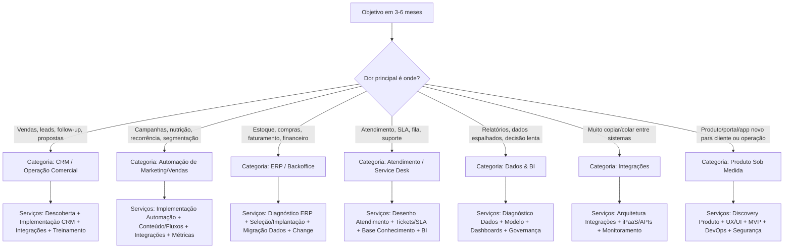
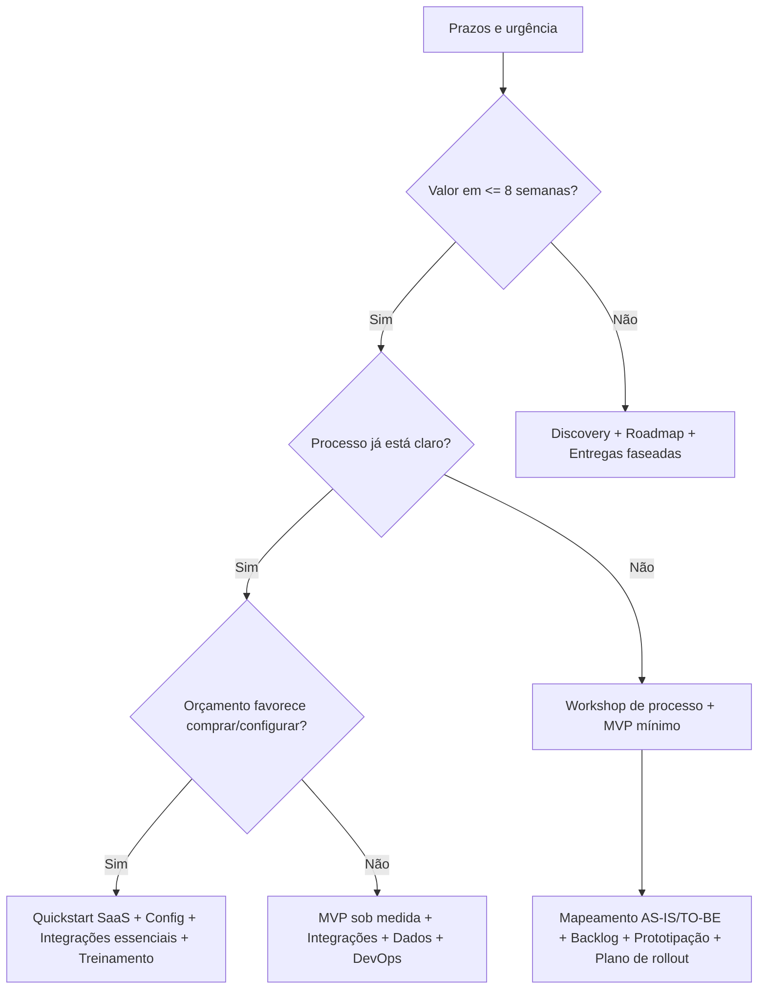
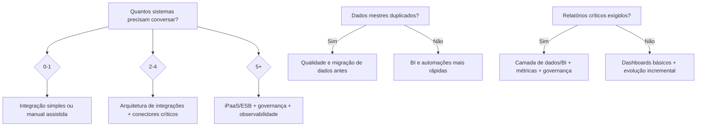

# Perguntas coringa 80/20 para um formulário dinâmico com IA que recomenda a solução e mapeia serviços

## Resumo executivo

Um formulário de qualificação “80/20” para projetos de software precisa descobrir, com linguagem leiga, o que **realmente define escopo e solução**: objetivo de negócio, processo crítico (onde dói), quem usa, volume/escala, dados/relatórios, integrações, restrições (prazo/orçamento/compliance) e risco de adoção. Isso é, na prática, coletar as principais classes de requisitos (negócio, stakeholders, solução e transição) e sinais de risco para implantação, como recomendado por referências de business analysis como a entity["organization","International Institute of Business Analysis","business analysis association"] (IIBA). citeturn1search1turn1search5

A recomendação mais eficaz é estruturar seu formulário como um **wizard** (passo a passo com lógica condicional), reduzindo carga cognitiva via **progressive disclosure** (mostrar só o que é relevante agora) e usando validação/erros legíveis e acessíveis. Essas práticas são sustentadas por guidelines de UX de organizações como a entity["organization","Nielsen Norman Group","ux research firm"], a entity["organization","Baymard Institute","ux research institute"] e padrões governamentais como o entity["organization","GOV.UK Design System","uk gov design system"], além de critérios de acessibilidade do entity["organization","World Wide Web Consortium","web standards body"] (W3C/WCAG). citeturn4search0turn0search4turn4search8turn0search0turn0search1turn1search2turn1search6turn3search11turn3search0turn3search3

Abaixo você recebe: (1) 30 perguntas simples, priorizadas e justificadas, com mapeamento para serviços; (2) templates de árvore de decisão em Mermaid; (3) exemplos reais/típicos de respostas e roteamento; (4) como a IA deve lidar com respostas vagas e incertezas; (5) recomendações de UX (ordem, linguagem, validação, follow-ups dinâmicos); (6) métricas para medir eficácia.

## Fundamentos do modelo de diagnóstico 80/20

A lógica central do seu formulário deve separar rapidamente três decisões que mudam todo o jogo:

Primeiro, **qual “família” de solução** resolve melhor o problema: CRM, automação de marketing/vendas, ERP/backoffice, atendimento (tickets/SLA), dados/BI, integrações, ou produto sob medida. Definições práticas ajudam principalmente quando o lead pede “um CRM” mas a dor real é backoffice, por exemplo: CRM foca em gerenciar relacionamento/interações com clientes e processos de vendas/serviço; ERP integra processos centrais (financeiro, compras, estoque, manufatura etc.); automação de marketing automatiza tarefas repetitivas (nutrição, campanhas, segmentação) e personalização em escala. citeturn2search0turn2search1turn2search2turn2search9turn2search10turn2search3

Segundo, **qual abordagem de entrega** faz sentido: “comprar e configurar” (SaaS/plug-and-play/low-code) vs “construir” (MVP/produto novo). Essa escolha depende de urgência, orçamento, diferenciação competitiva e maturidade do processo (se nem o processo está claro, construir vira “codar neblina”). Boas práticas de discovery existem justamente para reduzir ambiguidades, mapear riscos e transformar necessidade em plano executável. citeturn1search0turn1search20turn3search9

Terceiro, **quão grande é a fricção de implantação**: qualidade de dados, integrações, compliance, adoção e governança. Isso não é detalhe técnico; é o que derruba projeto bonito. Padrões como WCAG reforçam inclusive o cuidado com validação/feedback e mensagens de erro (clareza, texto explícito, sugestão de correção), que é um bom paralelo para o próprio formulário: não basta perguntar; tem que ajudar o lead a responder. citeturn3search11turn3search0turn3search8turn1search2turn0search8

Para “amarrar” tudo em um mecanismo de qualificação, frameworks de vendas como BANT (Budget, Authority, Need, Timeline) e MEDDIC/MEDDPICC (métricas, decisores, critérios/processo de decisão, dor, champion etc.) são úteis como **estrutura** — mas suas perguntas precisam parecer conversa, não interrogatório corporativo. citeturn0search3turn4search7turn4search3turn4search11

## Perguntas coringa priorizadas com justificativa e mapeamento para serviços

A tabela abaixo traz 30 perguntas “não técnicas” em linguagem cotidiana. A ideia é:

- Usar as 12 primeiras como **núcleo obrigatório** (triagem de solução + escopo).
- As demais entrarem como **follow-ups dinâmicos** conforme respostas (ex.: só perguntar sobre compliance se o lead mencionar setor regulado). Isso segue o princípio de progressive disclosure para reduzir carga cognitiva. citeturn0search4turn4search8turn4search0

### Catálogo de serviços sugerido como base de roteamento

Para mapear respostas, vou usar estas categorias (adapte nomes ao seu catálogo):

- Descoberta e diagnóstico (workshops, mapeamento AS-IS/TO-BE, requisitos)
- Estratégia e roadmap (priorização, business case, OKRs/KPIs)
- Implementação de CRM (vendas/CS), automação e playbooks
- Implementação de automação de marketing (fluxos, lead scoring, segmentação)
- ERP/backoffice (seleção/implantação/integração fiscal/estoque)
- Atendimento e suporte (tickets, SLA, base de conhecimento)
- Integrações (iPaaS/APIs, integração com WhatsApp/e-commerce/financeiro)
- Dados e BI (dashboards, modelagem, governança, data pipeline)
- Migração e qualidade de dados (limpeza, deduplicação, “cadastro único”)
- Segurança e compliance (LGPD, auditoria, controles)
- Gestão de mudança (treinamento, adoção, governança)
- Sustentação e evolução (monitoramento, melhorias contínuas)

### Tabela de perguntas

| Prioridade | Pergunta simples (texto de UI) | Por que importa | Respostas típicas direcionam para quais serviços |
|---:|---|---|---|
| 1 | Qual é o resultado mais importante que você quer alcançar nos próximos 3–6 meses? | Define requisito de negócio e “família” de solução. Requisitos de negócio são um tipo central em BA. citeturn1search5turn1search1 | “Vender mais” → CRM + automação; “reduzir retrabalho/custos” → ERP/integrações; “decidir com dados” → BI/dados. citeturn2search0turn2search1turn2search2 |
| 2 | O que hoje mais te impede de chegar nesse resultado? (onde dói no dia a dia) | Identifica dor e prioriza escopo (discovery). Discovery existe para clarificar ambiguidade e obstáculos. citeturn1search0turn1search20 | Dor em vendas/lead/proposta → CRM; dor em operação/financeiro/estoque → ERP; dor em atendimento → tickets/SLA; dor em dados → dados/BI. citeturn2search0turn2search1turn2search2 |
| 3 | Se você pudesse arrumar só UMA coisa amanhã, o que seria? | Força o 80/20 e revela processo crítico. (Escopo inicial/MVP). citeturn1search0 | “Organizar follow-up de leads” → CRM quickstart; “parar de copiar dados” → integrações/automação; “relatório diário” → BI/dados. |
| 4 | Em quais tarefas você mais usa planilhas, copiar/colar, ou “caça informações” em vários lugares? | Sinal forte de automação e integração; também mede desperdício operacional. citeturn1search0 | “Copio dados do comercial para financeiro” → integrações + governança; “planilha de pipeline” → CRM; “planilha de estoque” → ERP/OMS. citeturn2search0turn2search1 |
| 5 | Quem participa do processo (áreas/papéis)? Ex.: vendas, financeiro, operação, suporte, diretoria | Dá mapa de stakeholders e requisitos de stakeholder (IIBA). citeturn1search1turn1search5 | Muitos papéis e aprovações → workflows + governança + gestão de mudança; poucos usuários → quickstart mais simples. citeturn0search3turn4search7 |
| 6 | Quantas pessoas vão usar no início e quantas em 12 meses? (aprox.) | Escala influencia arquitetura, licenças, suporte e esforço de adoção. citeturn3search9 | “Começa com 5, vira 80” → plataforma escalável + treinamento; “só 3 pessoas” → solução enxuta (SaaS/config). |
| 7 | Qual é a ordem de grandeza do volume mensal? (ex.: leads, pedidos, atendimentos, notas) | Volume impacta performance, automação e necessidade de BI; também muda complexidade de integração. citeturn2search1turn2search9 | Alto volume → automação + BI + integração; baixo volume → foco em processo e adoção. |
| 8 | Em que pontos alguém precisa aprovar, validar ou dar “ok” antes de seguir? | Revela necessidade de workflow, trilha de auditoria e regras de negócio. citeturn1search5turn3search9 | Muitas aprovações → BPM/workflow + perfis de acesso + auditoria (compliance). |
| 9 | Qual informação precisa ser “cadastro único” e sempre correta? (cliente, produto, contrato, preço) | Governa dados mestres; sem isso, CRM/ERP vira “planilha cara”. citeturn2search1turn2search9 | “Cliente duplicado” → migração/qualidade de dados + governança; “produto/estoque” → ERP/backoffice. |
| 10 | Que decisões você gostaria de tomar com base em um painel? O que você quer ver em 1 tela? | BI orientado a decisão (não “relatório por relatório”). citeturn2search7turn2search1 | “Conversão por canal e etapa” → CRM + BI; “margem por produto” → ERP + BI; “SLA/NPS” → suporte + BI. |
| 11 | Hoje você consegue medir isso com facilidade? (sim / mais ou menos / não) | Sinaliza maturidade digital e gaps de instrumentação/dados. citeturn4search8 | “Não” → diagnóstico de dados + instrumentação + BI; “sim” → foco em automação e execução. |
| 12 | Quais ferramentas/sistemas você já usa e precisa manter? (ex.: financeiro, e-commerce, WhatsApp, planilhas) | Integrações são determinantes de custo/risco; também definem “limites do jogo”. citeturn2search9turn2search1 | Muitos sistemas → arquitetura de integrações/iPaaS; poucos → implantação mais rápida. |
| 13 | Hoje existe um lugar que é a “fonte oficial” da informação? Ou cada área tem a sua? | “Fonte da verdade” define arquitetura e governança (dados). citeturn2search1turn2search9 | “Cada área tem a sua” → governança + MDM + integração; “tem dono” → integração mais simples. |
| 14 | Como as informações entram hoje? (digitando, importando planilha, formulário, automático) | Define automação de entrada, qualidade e UX do processo. citeturn1search0turn4search8 | Muito manual → automação + formulários + validação; importações → pipelines + qualidade de dados. |
| 15 | Por quais canais você vende/atende hoje? (site, WhatsApp, Instagram, loja, representantes, telefone) | Revela necessidade omnichannel e integrações front-to-back. citeturn2search0turn2search2 | Multi-canal com perda de histórico → CRM + integrações + atendimento/tickets. |
| 16 | Seu time segue etapas claras (um “caminho padrão”) ou cada um faz do seu jeito? | Mede maturidade de processo; CRM funciona melhor quando existe pipeline claro. citeturn2search0turn2search3 | “Cada um faz do seu jeito” → diagnóstico + desenho de processo + CRM; “etapas claras” → implementação direta. |
| 17 | Como você acompanha leads e propostas hoje? (planilha, e-mail, ferramenta, “na cabeça”) | Indica urgência de CRM e ganhos rápidos (“planilha é o CRM do desespero”). citeturn2search0turn2search12 | Planilhas/WhatsApp solto → CRM quickstart + playbooks + integração de canais. |
| 18 | E depois que vende, como é o pós-venda/atendimento? Tem SLA, fila, categorias de problemas? | Define necessidade de atendimento/ticketing e base de conhecimento. citeturn2search3turn2search0 | SLA e alto volume → atendimento + automação; atendimento informal → estruturar processos + ferramenta. |
| 19 | Você precisa controlar estoque, compras, faturamento, emissão fiscal ou conciliação financeira junto? | Pergunta “porta de entrada” para ERP/backoffice. citeturn2search1turn2search9turn2search5 | “Sim” → diagnóstico ERP + implantação/integração; “não” → CRM/automação pode bastar. |
| 20 | Existe alguma exigência de privacidade/auditoria? (ex.: dados sensíveis, setor regulado, LGPD) | Compliance muda requisitos não funcionais e desenho de acesso/logs. WCAG reforça clareza e correção, e requisitos de qualidade são parte do ciclo. citeturn3search11turn3search9turn3search4 | “Sim” → pacote segurança/compliance + governança de dados; “não sei” → assessment rápido + recomendação. |
| 21 | Em quanto tempo você precisa ver valor? (ex.: 2 semanas, 2 meses, 6 meses) | Timeline é pilar de qualificação (BANT) e define abordagem de entrega. citeturn0search3turn0search7 | Prazo curto → quickstart + MVP; prazo longo → discovery + roadmap + implantação faseada. |
| 22 | Existe alguma data “inegociável”? (campanha, contrato, auditoria, sazonalidade) | Define risco, fatiamento e plano de release. citeturn1search0 | Hard deadline → fase 1 mínima + fase 2; exige governança de escopo. |
| 23 | Qual faixa de investimento parece viável hoje? (sem compromisso: baixo/médio/alto) | Budget é pilar de qualificação (BANT); direciona buy vs build e escopo. citeturn0search3turn0search7 | Baixo → SaaS/config; médio → SaaS + integrações; alto → produto sob medida + dados + segurança. |
| 24 | Quem decide junto e quem dá o “ok final”? | Authority/decision process (BANT/MEDDIC) afeta ciclo e dependências. citeturn0search3turn4search7 | Muitos decisores → mapear stakeholders + champion + plano de validação. |
| 25 | Como você vai saber que deu certo? Me diga 3 sinais de sucesso (números ou fatos) | “Métricas” é central em MEDDIC; também vira critério de aceite. citeturn4search7turn4search3turn3search9 | Métricas claras → OKRs/KPIs + instrumentação; vagas → workshop de métricas e baseline. |
| 26 | Quais são os maiores medos/receios? (parar operação, perder dados, equipe não usar, segurança) | Expõe riscos e necessidades de mitigação (migração, mudança, segurança). citeturn1search0turn3search9 | “Equipe não vai usar” → change + treinamento; “perder dados” → migração/backup/testes; “segurança” → compliance. |
| 27 | Se nada mudar, o que acontece em 12 meses? | Quantifica urgência e custo de inação (prioridade). citeturn4search11turn4search7 | Forte impacto → priorização agressiva; baixo impacto → roadmap gradual. |
| 28 | Você prefere comprar e ajustar uma ferramenta ou construir algo sob medida? Por quê? | Direciona estratégia (buy vs build) e evita “customizar SaaS até quebrar”. Requisitos devem evitar amarrar design cedo demais. citeturn3search9turn1search25 | “Comprar” → seleção/implantação; “construir” → discovery + UX + MVP. |
| 29 | Você já tentou resolver isso antes? O que funcionou e o que travou? | Captura restrições reais, dependências e aprendizados; reduz retrabalho. citeturn1search0 | “Falhou por dados ruins” → qualidade de dados primeiro; “falhou por adoção” → change e governança. |
| 30 | Tem alguém interno que vai tocar o projeto no dia a dia (ponto focal)? | Champion (MEDDIC) e dono do processo reduzem risco de implantação. citeturn4search7turn4search3turn4search11 | Sem dono → risco alto → serviço de governança + sponsorship + gestão de mudança. |

Observação prática: isso parece muita pergunta (e é). Por isso o “pulo do gato” é usar **lógica condicional** e **progressive profiling**: coletar o essencial agora e aprofundar depois conforme contexto, como recomendado em abordagens de formulários dinâmicos e personalização por lógica. citeturn4search30turn4search1turn4search10

## Templates de fluxo lógico e árvores de decisão

A seguir, três templates “plugáveis” (você pode trocar os nomes das categorias para casar com seu catálogo e treinar sua IA para preencher os nós).

### Triagem de categoria de solução principal

### Escolha de abordagem de entrega e pacote de serviços

### Profundidade de dados e integrações

## Exemplos de respostas típicas e roteamento para serviços

Os exemplos abaixo mostram como respostas “humanas” (muitas vezes imperfeitas) podem mapear para serviços. Eles são inspirados por padrões comuns de adoção: formulários de geração de leads em SaaS tendem a pedir pouco no início e usar progressive profiling para coletar tamanho do time, casos de uso e objetivos depois. citeturn4search38turn4search30turn4search1

### Tabela de cenários

| Cenário | Respostas típicas do lead (exemplos) | Categoria de solução indicada | Serviços do catálogo que “encaixam” |
|---|---|---|---|
| Empresa B2B de serviços (10–30 pessoas) | “Quero vender mais”; “perco leads no WhatsApp”; “pipeline tá na planilha”; “preciso em 30–60 dias”; “sem time de TI” | CRM + integração de canais | Descoberta curta (1–2 workshops) + Quickstart CRM + playbook de vendas + integração WhatsApp/e-mail + treinamento + dashboards de funil |
| E-commerce crescendo | “Pedido aumentou muito”; “marketing manda campanha mas não segmenta”; “suporte tá virando caos”; “quero ver margem por produto” | Automação + Atendimento + Dados | Implementação automação (fluxos, segmentação) + atendimento/tickets/SLA + integração e-commerce ↔ ERP/financeiro + BI (margem, cohort, SLA) |
| Distribuição/indústria | “Estoque e compras são uma confusão”; “faturamento e financeiro não batem”; “muita aprovação”; “auditoria pesa” | ERP/backoffice + integrações | Diagnóstico ERP + seleção/implantação + migração e saneamento de cadastros + integrações com vendas/CRM + segurança/compliance + gestão de mudança |
| Startup/SaaS criando portal do cliente | “Preciso de um portal/app”; “quero MVP em 8–12 semanas”; “diferencial competitivo”; “integra com billing e suporte” | Produto sob medida + integrações | Discovery de produto + UX/UI + MVP + DevOps + integrações com billing/suporte + observabilidade + segurança básica |
| Serviços profissionais com foco em atendimento | “Quero reduzir tempo de resposta”; “SLA e categorias”; “reclamações por demora”; “reports semanais” | Atendimento/service desk + BI | Desenho de atendimento + setup de tickets/SLA + base de conhecimento + automações de triagem + BI de SLA/NPS/tempo de fila |
| Organização com dados espalhados | “Diretoria não confia nos números”; “cada área tem um relatório”; “cadastro duplicado”; “preciso de um painel único” | Dados & BI + governança | Diagnóstico de dados + definição de fonte oficial + qualidade/migração + modelo de dados + dashboards executivos + governança contínua |

## Como a IA deve interpretar respostas vagas e sinalizar incerteza

### Estratégia de interpretação em camadas

Um bom comportamento de IA aqui é “extrair e classificar” em vez de “adivinhar”. Eu recomendo uma arquitetura de interpretação com três camadas:

Camada de extração estruturada: A IA transforma texto livre em um objeto com campos como `objetivo`, `dor_principal`, `processo_critico`, `usuarios`, `volume`, `integracoes`, `relatorios`, `restricoes`, `compliance`, `prazo`, `orcamento`, `maturidade`, `metricas_sucesso`, `riscos`, `dependencias`, cada um com `valor` + `confianca` (0–1) + `evidencias` (trechos). Isso casa com a ideia de separar tipos de requisito (negócio/stakeholder/solução/transição). citeturn1search1turn1search5turn3search9

Camada de classificação de categoria: A IA escolhe 1–2 categorias principais (ex.: CRM vs ERP) e 0–3 categorias adjacentes (ex.: “CRM + integrações + BI”). As definições de CRM/ERP/automação ajudam a manter consistência sem depender de buzzwords do lead. citeturn2search0turn2search1turn2search2turn2search3

Camada de roteamento para serviços e próximos passos: A IA recomenda “pacotes” do catálogo e gera follow-ups apenas onde a confiança estiver baixa.

### Heurísticas para lidar com respostas vagas

Respostas vagas são o padrão, não a exceção. O formulário deve tratá-las como sinal e reagir de forma útil.

**Quando o lead diz “quero melhorar / organizar / digitalizar”**  
A IA deve reconhecer ausência de objetivo mensurável e acionar uma pergunta de aterrissagem: “Qual dessas opções descreve melhor: vender mais / reduzir custo / melhorar atendimento / controlar operação / enxergar números / outro?”. Isso reduz carga cognitiva (clareza e suporte) e evita esforço mental excessivo. citeturn4search8turn0search4

**Quando o lead não sabe volume (“muitos pedidos”)**  
Converter para faixas: “menos de 100 / 100–1.000 / 1.000–10.000 / 10.000+ por mês”. Perguntas com escala explícita reduzem ambiguidade e tendem a melhorar qualidade de resposta em surveys. citeturn4search25

**Quando o lead diz “orçamento baixo”**  
A IA deve pedir um proxy não constrangedor: “Você está mais perto de (A) resolver rápido e simples agora ou (B) construir algo robusto para escalar?”. Isso aproxima de budget sem valores e ainda ajuda decisioning (BANT mantém budget como eixo de qualificação). citeturn0search3turn0search7

**Quando o lead mapeia solução em vez de problema (“quero um CRM”)**  
A IA deve validar e redirecionar: “Perfeito. Para confirmar: o problema principal é perder follow-up/visibilidade do funil ou tem algo de estoque/financeiro também?”. Isso evita erro clássico de requisitos amarrados cedo demais à solução. citeturn1search25turn3search9

**Quando aparecem sinais de compliance (“dados sensíveis”, “auditoria”)**  
A IA deve elevar prioridade de segurança/compliance e pedir detalhes mínimos (“quais dados”, “quem acessa”, “necessidade de logs”). Requisitos não funcionais são parte de “solution requirements” (IIBA) e padrões de qualidade são usados para especificação/avaliação ao longo do ciclo. citeturn1search1turn3search4turn3search9

### Sinalização explícita de incerteza

Recomendo o sistema produzir, junto da recomendação, um bloco “o que ainda não sabemos” (interno e opcionalmente visível ao lead), com:

- Campos críticos com `confianca < 0,6` (ex.: volume, integrações, dono do processo).
- Riscos inferidos (ex.: baixa maturidade de métricas; ausência de champion).
- Próximas 3 perguntas de maior ganho de informação.

Essa transparência melhora a conversa e reduz o risco de a IA parecer “mágica demais” (e errada).

## Recomendações de UX para o formulário

### Estrutura e ordem recomendadas

O padrão mais resiliente para esse tipo de qualificação é wizard de 6–8 passos (não telas infinitas), em que passos posteriores dependem das respostas anteriores. Um wizard é, por definição, passo a passo com dependência entre etapas. citeturn4search0

Sequência sugerida:

1) Objetivo e dor (perguntas 1–3)  
2) Processo e pessoas (4–6, 8)  
3) Volume e canais (7, 15–18)  
4) Dados e integrações (9–14)  
5) Restrições e decisão (20–24)  
6) Sucesso e riscos (25–30)  
7) Contato e próxima ação (agendar diagnóstico/demonstração)

Esse funil conversa bem com princípios de reduzir carga cognitiva e usar progressive disclosure (estrutura/clareza/suporte). citeturn4search8turn0search4

### Linguagem e microcopy

- Use exemplos entre parênteses (como já proposto nas perguntas) para “ensinar o lead a responder” sem parecer tutorial. Isso é suporte cognitivo. citeturn4search8  
- Evite jargões (“API”, “MDM”, “stakeholder”). Prefira “conectar sistemas”, “cadastro único”, “quem participa”.  
- Para perguntas delicadas (budget), use “faixas” e “sem compromisso”, reduzindo fricção de resposta (BANT continua atendido, mas com tato). citeturn0search3  

### Validação, erros e acessibilidade

Aqui vale ser rigoroso, porque isso afeta diretamente abandono e qualidade.

- Prefira validação inline (quando possível) para reduzir esforço de correção, como recomendado em guidelines de erros e estudos de validação inline. citeturn0search0turn0search1turn1search7  
- Mensagens de erro devem ser visíveis, específicas, em linguagem humana, próximas ao campo e com sugestão de como corrigir (padrões de NN/g, GOV.UK e WCAG “Error Identification” e “Error Suggestion”). citeturn0search8turn1search2turn1search6turn3search0turn3search8  
- Marque campos opcionais de forma explícita quando houver mistura de obrigatório/opcional; pesquisas de UX e guias de design discutem a importância dessa sinalização para reduzir confusão. citeturn0search5turn1search18  
- Em formulários longos, mostre progresso e permita voltar sem perder dados (princípios de wizards). citeturn4search0turn4search32  

image_group{"layout":"carousel","aspect_ratio":"16:9","query":["multi step wizard form UX example","inline validation form error message example","progressive disclosure form design example","conversational form one question at a time example"],"num_per_query":1}

### Follow-ups dinâmicos

A lógica condicional deve se basear em “lacunas de informação” e não em curiosidade. Exemplos:

- Se “objetivo = vender mais” e “processo de vendas não é padrão” → pergunte sobre etapas e critérios de lead (perguntas 16–17).  
- Se “muitos sistemas” → aprofundar integrações (perguntas 12–13) e adicionar: “qual sistema não pode parar?”  
- Se “compliance = sim/não sei” → adicionar mini-checklist de dados sensíveis e acessos.

Ferramentas de formulários com lógica mostram exatamente esse uso: ocultar/mostrar perguntas conforme o que você já sabe e tornar a experiência mais “conversacional”. citeturn4search1turn4search9

## Métricas para avaliar eficácia do formulário

Você quer medir não só “completou”, mas “completou e qualificou bem”. Sugiro um painel de métricas em quatro camadas.

### Tabela de métricas recomendadas

| Camada | Métrica | Como calcular | Por que importa |
|---|---|---|---|
| Conversão e fricção | Taxa de conclusão | envios concluídos / iniciados | Resume fricção geral; melhorias de design de formulário podem impactar conversão. citeturn0search13turn4search8 |
| Conversão e fricção | Drop-off por etapa | abandono em cada step | Mostra onde suas perguntas “assustam” ou confundem. citeturn4search8turn4search0 |
| Conversão e fricção | Tempo mediano por etapa | mediana do tempo | Passos lentos indicam linguagem ruim ou pergunta difícil. citeturn4search8 |
| Qualidade de dados | Taxa de respostas vagas | % campos críticos com “não sei / depende / tanto faz” | Indica necessidade de faixas, exemplos, ou follow-ups guiados. citeturn4search25 |
| Qualidade de dados | Completude de campos críticos | % leads com objetivo + dor + volume + sistemas + prazo preenchidos | Mede se o 80/20 está funcionando (informação suficiente para diagnóstico). citeturn1search1turn1search5 |
| Qualificação comercial | Taxa de agendamento | reuniões agendadas / envios | Conecta formulário ao próximo passo de receita. (BANT/MEDDIC dão estrutura do que “qualificado” significa.) citeturn0search3turn4search7 |
| Qualificação comercial | Aceitação pelo time (QA humano) | % recomendações “faz sentido” (nota 1–5) | Valida se o sistema recomenda a categoria correta e o pacote certo. |
| Resultado de negócio | Lead → proposta | propostas / envios | Mede impacto real na esteira comercial. |
| Resultado de negócio | Proposta → ganho | ganhos / propostas | Mostra se qualificação reduz desperdício (menos proposta para lead errado). |
| Modelo/IA | Confiança média por campo e por categoria | média de `confianca` | Ajuda a calibrar thresholds: quando perguntar mais vs quando recomendar. |
| Modelo/IA | Taxa de “reclassificação” | % casos em que consultor muda a categoria | Seu principal indicador de erro do roteamento. |
| Operação | Tempo economizado no diagnóstico | (tempo antes – tempo depois) por lead | Se cair, você ganhou escala sem contratar “clones” do seu melhor pré-vendas. |

### Metas iniciais pragmáticas

- Atingir alta conclusão com perguntas essenciais, usando progressive disclosure e lógica. Princípios de reduzir carga cognitiva e validação clara suportam essa direção. citeturn4search8turn0search4turn0search1  
- Reduzir respostas vagas via escalas/faixas e exemplos (qualidade acima de quantidade). citeturn4search25turn4search8  

Se você aplicar esse pacote, seu formulário deixa de ser “um monte de campos” e vira um **diagnóstico comercial automatizado**: curto quando precisa ser curto, profundo quando precisa ser preciso — e sempre amarrado ao seu catálogo de serviços.